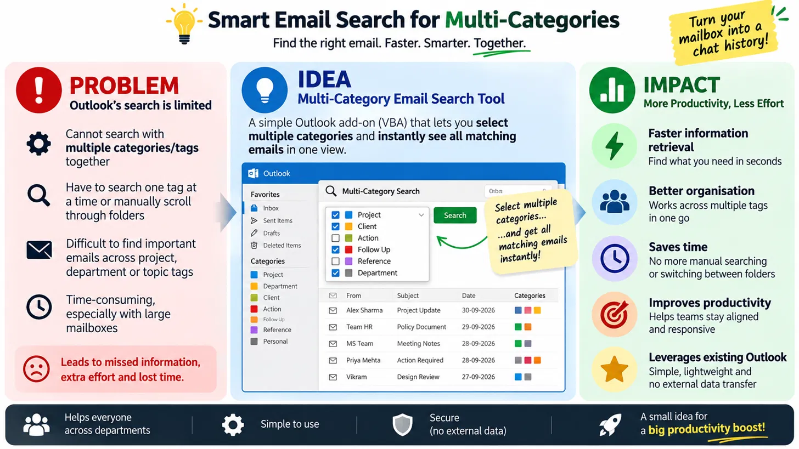

# 📧 Smart Email Search for Multi-Categories — Outlook VBA Add-on

> **Find the right email. Faster. Smarter. Together.**
> A lightweight Outlook VBA macro that lets you search across **multiple categories at once** — something Outlook cannot do natively.



---

## 🚩 The Problem

Outlook built-in search only lets you filter **one category at a time**. If you tag emails with `Project`, `Client`, `Follow Up`, etc., finding all emails that belong to *two or more* of those categories means endless manual scrolling. With large mailboxes, this wastes serious time.

---

## 💡 The Solution

This VBA add-on adds a **Category Search** panel to Classic Outlook (desktop). You:

1. Tick any combination of your existing colour categories
2. Choose **AND** (email must have *all* selected) or **OR** (email has *at least one*)
3. Click **Search** — results appear instantly in a sorted grid

No external software. No data leaves your PC. Works entirely inside Outlook.

---

## ✨ Features

| Feature | Detail |
|---|---|
| **Multi-category filter** | AND / OR logic across as many categories as you like |
| **Scope control** | Inbox only → Inbox + subfolders → Whole mailbox → Shared mailboxes |
| **Sender filter** | Narrow by sender name or email address |
| **Keyword filter** | Subject-only or full-body search |
| **Attachment filter** | Show only emails that have attachments |
| **Date range** | Filter by received date (From / To) |
| **Results grid** | Subject · Sender · Date · Categories · Folder — double-click to open the email |
| **Export to Excel** | One-click export of the result list |
| **Save to folder** | Move / copy matched emails to a chosen Outlook folder |
| **Fast on big mailboxes** | Uses Folder.GetTable — mail items are **never opened**, so 10,000+ mails scan quickly |

---

## 📁 File Structure

```
outlook-vba-category-search/
├── modCategorySearch.bas       # Core search engine (import as a Module)
├── frmCategorySearch_code.txt  # UI form code — paste into frmCategorySearch
├── frmResults_code.txt         # Results form code — paste into frmResults
└── Smart_Email_Search_no_logo.png
```

---

## 🚀 Installation

> **Requires:** Microsoft Outlook (Classic / Desktop), Windows, VBA enabled.

### Step 1 — Open the VBA Editor
In Outlook, press **Alt + F11** to open the Visual Basic Editor.

### Step 2 — Import the module
1. In the Project tree (left panel), right-click your project → **Import File**
2. Select `modCategorySearch.bas`

### Step 3 — Create the two UserForms
You need two UserForms: `frmCategorySearch` and `frmResults`.

For **each** form:
1. In the VBE menu: **Insert → UserForm**
2. Rename it (Properties window, `Name` field) to `frmCategorySearch` (or `frmResults`)
3. Select the form → press **F7** to open its code window
4. Select all existing code → delete it
5. Open the matching `.txt` file from this repo and paste its entire contents

### Step 4 — Add to Quick Access Toolbar *(optional but recommended)*
1. In Outlook, right-click the Quick Access Toolbar → **Customize Quick Access Toolbar**
2. Choose **Macros** in the "Choose commands from" dropdown
3. Find `modCategorySearch.ShowCategorySearch` → Add → OK

### Step 5 — Run it!
Click the toolbar button (or run `ShowCategorySearch` from the VBE) to open the search panel.

---

## 🖥️ How to Use

1. **Pick categories** — click to toggle (multi-select supported)
2. **Choose match logic** — ALL (AND) or ANY (OR)
3. **Set scope** — Inbox / subfolders / whole mailbox / shared mailboxes
4. Optionally add **sender**, **keyword**, **date range**, or **attachments only** filter
5. Click **Search**
6. In the results window:
   - **Double-click** any row to open that email
   - **Export list to Excel** — saves a spreadsheet of the results
   - **Save emails to folder** — moves/copies matched emails to a chosen folder

---

## ⚙️ How It Stays Fast

- `Folder.GetTable` reads only the specific columns needed — mail items are **never fully opened**
- Categories are matched with **exact name comparison** (so "HR" never accidentally matches "HRS")
- A DASL server-side filter is applied **only** when body search is enabled
- All filtering happens in VBA on the table rows — no round-trips per email

---

## 🔒 Privacy and Security

- **100% local** — no data is sent to any server or external service
- Runs entirely within Outlook VBA sandbox
- No third-party libraries or COM add-ins required

---

## 🤝 Contributing

Pull requests welcome! Ideas for improvement:
- [ ] Export results as CSV
- [ ] Remember last-used category selections
- [ ] Support Outlook on Mac (currently Windows / Classic Outlook only)
- [ ] Add a "Select All / Clear All" categories button

---

## 📄 License

MIT License — free to use, modify, and share.

---

*Built to make Outlook power-users more productive.*
